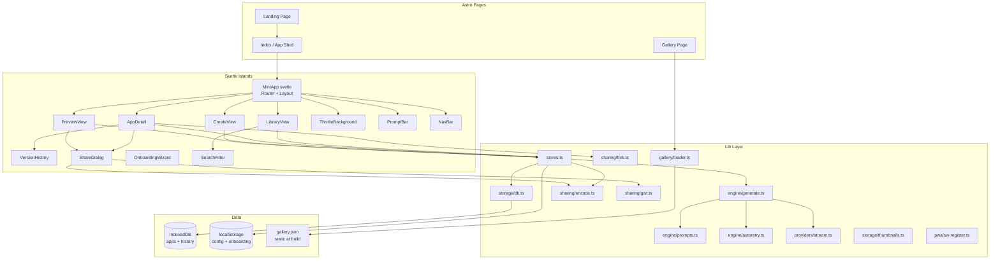
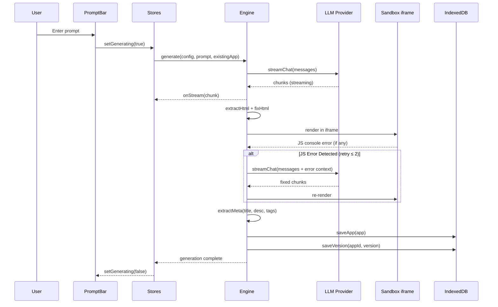
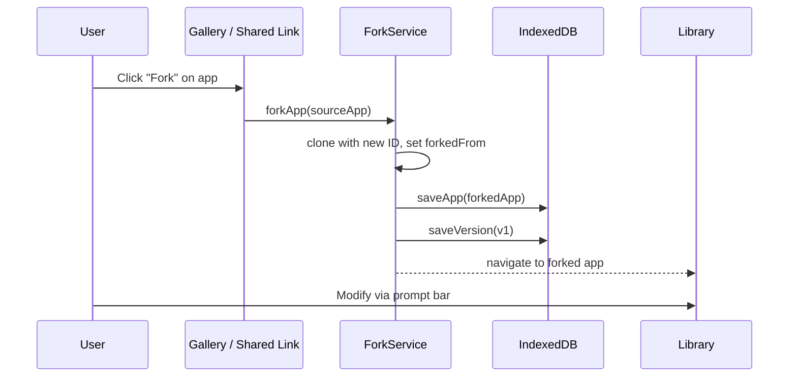
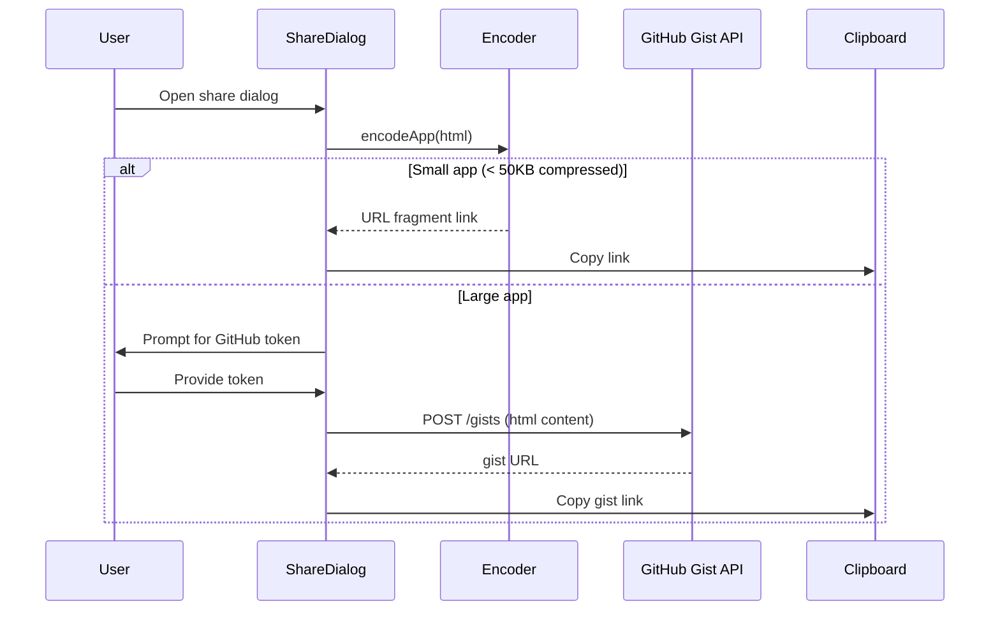

# Design Document: Mint AI — Remaining Phases (2-4)

## Overview

Mint AI is a local-first personal app store where AI generates self-contained web apps on demand. Phase 1 (complete) delivers the core generation loop: prompt → LLM stream → HTML extraction → sandbox preview, with IndexedDB storage, multi-provider support, and a glass morphism dark UI.

Phases 2-4 build on this foundation to create a YC-demo-ready product. Phase 2 focuses on library polish, version history, iteration UX, and a 3D animated background for visual wow factor. Phase 3 adds sharing infrastructure (Gist integration, fork/remix, static gallery) and PWA support. Phase 4 delivers the final polish layer: landing page, onboarding wizard, mobile optimization, auto-retry on JS errors, and library search/filter.

The architecture remains entirely client-side — no server, no accounts. All new features extend the existing Svelte 5 stores, IndexedDB schema, and Astro island architecture. The only new runtime dependency is Threlte (Three.js for Svelte) for the 3D background.

## Architecture



## Sequence Diagrams

### App Generation with Auto-Retry



### Fork/Remix Flow



### Share via Gist



## Components and Interfaces

### Component: LibraryView

**Purpose**: Enhanced grid display of user's apps with thumbnails, search/filter, and improved cards.

**Interface**:
```typescript
interface LibraryViewProps {
  apps: App[];
  onOpenApp: (app: App) => void;
  onDeleteApp: (id: string) => void;
  onNewApp: () => void;
}
```

**Responsibilities**:
- Render app cards in responsive grid with thumbnail previews
- Provide search by title/description/tags and filter by tag
- Sort by updatedAt (default), createdAt, or title
- Show empty state with prompt suggestions for new users

### Component: AppDetail

**Purpose**: Dedicated single-app view with preview, metadata, version history, and sharing.

**Interface**:
```typescript
interface AppDetailProps {
  app: App;
  onBack: () => void;
  onModify: (prompt: string) => void;
  onFork: () => void;
}
```

**Responsibilities**:
- Full-width iframe preview of the app
- Display metadata (title, description, tags, created/updated dates)
- Version history timeline with rollback and diff
- Share button opening ShareDialog
- Modify button focusing prompt bar with app context

### Component: VersionHistory

**Purpose**: Timeline UI showing all versions of an app with rollback and diff capabilities.

**Interface**:
```typescript
interface VersionHistoryProps {
  appId: string;
  currentVersion: number;
  onRollback: (version: AppVersion) => void;
}
```

**Responsibilities**:
- Fetch and display version timeline from IndexedDB
- Show prompt used for each version
- Rollback to any previous version (creates new version from old HTML)
- Simple text diff between adjacent versions

### Component: ShareDialog

**Purpose**: Modal for sharing apps via URL fragment, Gist, or file download.

**Interface**:
```typescript
interface ShareDialogProps {
  app: App;
  onClose: () => void;
}
```

**Responsibilities**:
- Generate URL fragment link (small apps)
- Create GitHub Gist (large apps, requires token)
- Download as .html file
- Copy link to clipboard with feedback
- Show QR code for mobile sharing

### Component: ThrelteBackground

**Purpose**: Subtle 3D animated background using Threlte (Three.js for Svelte).

**Interface**:
```typescript
interface ThrelteBackgroundProps {
  variant: 'mesh-gradient' | 'particle-field';
  intensity: number; // 0-1, reduced during generation
}
```

**Responsibilities**:
- Render animated 3D scene behind app content
- Respond to user interactions (subtle parallax on mouse move)
- Reduce intensity during generation to save GPU
- Graceful fallback to CSS gradient if WebGL unavailable

### Component: OnboardingWizard

**Purpose**: First-run experience guiding users through provider setup.

**Interface**:
```typescript
interface OnboardingWizardProps {
  onComplete: () => void;
  onSkip: () => void;
}
```

**Responsibilities**:
- Step 1: Welcome + value proposition
- Step 2: Provider selection with guided API key entry
- Step 3: Test generation with a sample prompt
- Persist completion state to localStorage

### Component: SearchFilter

**Purpose**: Search bar and tag filter chips for the library view.

**Interface**:
```typescript
interface SearchFilterProps {
  apps: App[];
  onFilteredApps: (filtered: App[]) => void;
}
```

**Responsibilities**:
- Full-text search across title, description, prompt
- Tag filter chips (derived from all apps' tags)
- Debounced search input (300ms)

## Data Models

### Extended App (no schema migration needed — fields already exist)

```typescript
// Existing App interface is sufficient. thumbnail field will now be populated.
interface App {
  id: string;
  title: string;
  description: string;
  prompt: string;
  html: string;
  thumbnail: string | null;  // data:image/png;base64,... (captured from iframe)
  tags: string[];
  version: number;
  createdAt: number;
  updatedAt: number;
  shareId: string | null;    // gist ID or URL fragment hash
  forkedFrom: string | null; // source app ID or share URL
}
```

### Gallery App (static JSON)

```typescript
interface GalleryApp {
  id: string;
  title: string;
  description: string;
  tags: string[];
  author: string;
  html: string;           // full HTML content inline or URL to raw gist
  thumbnailUrl: string;   // static image URL
  featured: boolean;
  createdAt: number;
}

interface GalleryManifest {
  version: number;
  apps: GalleryApp[];
  categories: string[];
  updatedAt: number;
}
```

**Validation Rules**:
- `GalleryApp.html` must be non-empty and contain `<!DOCTYPE`
- `GalleryApp.tags` must be from the predefined tag set
- `GalleryManifest.version` must be monotonically increasing

### PWA Manifest

```typescript
interface MintPWAManifest {
  name: 'Mint AI';
  short_name: 'Mint AI';
  description: string;
  start_url: '/';
  display: 'standalone';
  background_color: '#0a0a0a';
  theme_color: '#22c55e';
  icons: Array<{ src: string; sizes: string; type: string }>;
}
```

### Onboarding State

```typescript
interface OnboardingState {
  completed: boolean;
  completedAt: number | null;
  skipped: boolean;
  providerConfigured: boolean;
}
```

**Validation Rules**:
- If `completed` is true, `completedAt` must be a valid timestamp
- `skipped` and `completed` are mutually exclusive for the initial run


## Key Functions with Formal Specifications

### Function 1: captureThumbail()

```typescript
async function captureThumbnail(iframe: HTMLIFrameElement): Promise<string | null>
```

**Preconditions:**
- `iframe` is mounted in the DOM and has loaded content via `srcdoc`
- `iframe.contentDocument` is accessible (same-origin sandbox)

**Postconditions:**
- Returns a `data:image/png;base64,...` string of max 64KB, or `null` on failure
- The iframe content is not mutated
- Captured at 400x300 resolution for consistent card thumbnails

**Implementation Notes:**
- Uses `html2canvas` on the iframe's body, or a simpler approach: render HTML into an offscreen canvas via `foreignObject` in SVG
- Falls back to `null` gracefully — cards show a gradient placeholder

### Function 2: autoRetryGeneration()

```typescript
async function autoRetryGeneration(
  config: ProviderConfig,
  prompt: string,
  existingApp: App | null,
  html: string,
  errors: string[],
  retryCount: number,
  onStream: (chunk: string) => void,
): Promise<GenerationResult>
```

**Preconditions:**
- `html` is the previously generated HTML that produced JS errors
- `errors` is a non-empty array of console error strings from the sandbox
- `retryCount` < `MAX_RETRIES` (2)
- `config` is a valid provider configuration

**Postconditions:**
- Returns a `GenerationResult` with fixed HTML, or the original if retries exhausted
- Total retry attempts never exceed `MAX_RETRIES`
- Each retry includes the error context in the LLM prompt
- `onStream` is called with retry status indicators

**Loop Invariants:**
- `retryCount` increments by exactly 1 per recursive call
- Previous error context is accumulated, not lost

### Function 3: forkApp()

```typescript
async function forkApp(
  source: App | GalleryApp,
  origin: 'library' | 'gallery' | 'shared-link',
): Promise<App>
```

**Preconditions:**
- `source` has non-empty `html` and `title`
- `source.id` exists (for library/gallery) or is derived from share URL

**Postconditions:**
- Returns a new `App` with a fresh `crypto.randomUUID()` id
- `forkedFrom` is set to `source.id` or the share URL
- `version` is 1, `createdAt` and `updatedAt` are `Date.now()`
- The forked app is saved to IndexedDB
- Version 1 is saved to the history store
- Original source app is not mutated

### Function 4: createGist()

```typescript
async function createGist(
  html: string,
  title: string,
  token: string,
): Promise<{ gistUrl: string; rawUrl: string }>
```

**Preconditions:**
- `token` is a valid GitHub personal access token with `gist` scope
- `html` is non-empty
- `title` is non-empty (used as filename)

**Postconditions:**
- Creates a public GitHub Gist with one file: `{title}.html`
- Returns the Gist URL and raw content URL
- Throws descriptive error on API failure (401, 403, 422)
- Token is never persisted to IndexedDB (only localStorage, user-controlled)

### Function 5: loadGallery()

```typescript
async function loadGallery(): Promise<GalleryManifest>
```

**Preconditions:**
- `gallery.json` exists in the `public/` directory at build time

**Postconditions:**
- Returns parsed `GalleryManifest` with all apps
- Apps are sorted by `featured` first, then `createdAt` descending
- Throws if JSON is malformed or version is unexpected

### Function 6: searchApps()

```typescript
function searchApps(
  apps: App[],
  query: string,
  tagFilter: string | null,
): App[]
```

**Preconditions:**
- `apps` is a valid array (may be empty)
- `query` is a trimmed string (may be empty)

**Postconditions:**
- If `query` is empty and `tagFilter` is null, returns all apps
- Search is case-insensitive across `title`, `description`, `prompt`, and `tags`
- If `tagFilter` is provided, results are further filtered to apps containing that tag
- Original array is not mutated; returns a new array
- Order is preserved from input

**Loop Invariants:**
- Each app is evaluated exactly once against the query and tag filter

### Function 7: rollbackToVersion()

```typescript
async function rollbackToVersion(
  appId: string,
  targetVersion: AppVersion,
): Promise<App>
```

**Preconditions:**
- `appId` exists in IndexedDB
- `targetVersion` exists in the history store for this `appId`

**Postconditions:**
- Creates a NEW version (current + 1) with the HTML from `targetVersion`
- The prompt for the new version is `"Rollback to version {targetVersion.version}"`
- The app's `updatedAt` is set to `Date.now()`
- Both the app record and new version record are saved atomically
- No history records are deleted — rollback is non-destructive

## Algorithmic Pseudocode

### Auto-Retry Algorithm

```typescript
const MAX_RETRIES = 2;

async function generateWithRetry(
  config: ProviderConfig,
  prompt: string,
  existingApp: App | null,
  onStream: (chunk: string) => void,
): Promise<GenerationResult> {
  // Step 1: Initial generation
  const result = await generate(config, prompt, existingApp, onStream);
  
  // Step 2: Render in hidden iframe, capture console errors
  const errors = await renderAndCaptureErrors(result.html, /* timeout */ 3000);
  
  if (errors.length === 0) return result;
  
  // Step 3: Retry loop
  let currentHtml = result.html;
  let currentErrors = errors;
  
  for (let retry = 0; retry < MAX_RETRIES && currentErrors.length > 0; retry++) {
    // INVARIANT: retry < MAX_RETRIES, currentErrors.length > 0
    onStream(`\n\n--- Auto-fix attempt ${retry + 1}/${MAX_RETRIES} ---\n`);
    
    const fixPrompt = buildFixPrompt(currentHtml, currentErrors);
    const fixResult = await generate(config, fixPrompt, null, onStream);
    
    currentHtml = fixResult.html;
    currentErrors = await renderAndCaptureErrors(currentHtml, 3000);
  }
  
  return { ...result, html: currentHtml };
}

function buildFixPrompt(html: string, errors: string[]): string {
  return `The following HTML app has JavaScript errors. Fix them.\n\n` +
    `Errors:\n${errors.map(e => `- ${e}`).join('\n')}\n\n` +
    `HTML:\n\`\`\`html\n${html}\n\`\`\``;
}
```

**Preconditions:**
- Valid provider config, non-empty prompt
- `renderAndCaptureErrors` has access to a hidden iframe in the DOM

**Postconditions:**
- Returns HTML that either has no JS errors or has been retried MAX_RETRIES times
- Total LLM calls: 1 (initial) + up to MAX_RETRIES (fixes) + metadata extraction

**Loop Invariants:**
- `retry` increments by 1 each iteration
- `currentErrors` is freshly captured after each fix attempt
- Previous HTML is replaced only if a new generation succeeds

### Thumbnail Capture Algorithm

```typescript
async function captureThumbnail(iframe: HTMLIFrameElement): Promise<string | null> {
  try {
    // Step 1: Wait for iframe content to settle
    await new Promise(resolve => setTimeout(resolve, 500));
    
    // Step 2: Create offscreen canvas
    const canvas = document.createElement('canvas');
    canvas.width = 400;
    canvas.height = 300;
    const ctx = canvas.getContext('2d')!;
    
    // Step 3: Serialize iframe content to SVG foreignObject
    const body = iframe.contentDocument?.documentElement.outerHTML;
    if (!body) return null;
    
    const svg = `
      <svg xmlns="http://www.w3.org/2000/svg" width="400" height="300">
        <foreignObject width="100%" height="100%">
          <div xmlns="http://www.w3.org/1999/xhtml">${body}</div>
        </foreignObject>
      </svg>`;
    
    // Step 4: Render SVG to canvas
    const img = new Image();
    const blob = new Blob([svg], { type: 'image/svg+xml;charset=utf-8' });
    const url = URL.createObjectURL(blob);
    
    await new Promise<void>((resolve, reject) => {
      img.onload = () => resolve();
      img.onerror = reject;
      img.src = url;
    });
    
    ctx.drawImage(img, 0, 0);
    URL.revokeObjectURL(url);
    
    // Step 5: Export as base64, enforce size limit
    const dataUrl = canvas.toDataURL('image/png', 0.7);
    return dataUrl.length <= 65536 ? dataUrl : null; // 64KB limit
  } catch {
    return null;
  }
}
```

**Preconditions:**
- iframe is in the DOM with loaded srcdoc content
- Browser supports Canvas and SVG foreignObject

**Postconditions:**
- Returns base64 PNG string ≤ 64KB or null
- No side effects on iframe content

### Gallery Search and Filter Algorithm

```typescript
function searchApps(apps: App[], query: string, tagFilter: string | null): App[] {
  const q = query.toLowerCase().trim();
  
  return apps.filter(app => {
    // INVARIANT: each app evaluated exactly once
    
    // Tag filter (if active)
    if (tagFilter && !app.tags.includes(tagFilter)) return false;
    
    // Text search (if query present)
    if (q.length === 0) return true;
    
    return (
      app.title.toLowerCase().includes(q) ||
      app.description.toLowerCase().includes(q) ||
      app.prompt.toLowerCase().includes(q) ||
      app.tags.some(t => t.toLowerCase().includes(q))
    );
  });
}
```

**Preconditions:**
- `apps` is a valid array, `query` is a string

**Postconditions:**
- Returns subset of apps matching both query and tag filter
- Original array not mutated
- O(n × m) where n = apps count, m = average field length

## Example Usage

```typescript
// Example 1: Generate app with auto-retry
const result = await generateWithRetry(
  $providerConfig,
  'Build a pomodoro timer with heatmap',
  null,
  (chunk) => streamContent.update(s => s + chunk),
);
// result.html is error-free (or best-effort after 2 retries)

// Example 2: Fork a gallery app
const galleryApp = gallery.apps.find(a => a.id === 'pomodoro-timer');
const myApp = await forkApp(galleryApp, 'gallery');
// myApp.forkedFrom === 'pomodoro-timer', myApp.id is new UUID

// Example 3: Share via Gist
const { gistUrl } = await createGist(app.html, app.title, githubToken);
// gistUrl === 'https://gist.github.com/user/abc123'

// Example 4: Rollback to version 2
const restoredApp = await rollbackToVersion(app.id, versions[1]);
// restoredApp.version === app.version + 1, html from version 2

// Example 5: Search library
const results = searchApps($apps, 'timer', 'productivity');
// returns apps matching "timer" with "productivity" tag

// Example 6: Capture thumbnail after generation
const thumbnail = await captureThumbnail(iframeRef);
if (thumbnail) {
  app.thumbnail = thumbnail;
  await saveApp(app);
}
```

## Correctness Properties

The following properties must hold universally across the system:

1. **Version Monotonicity**: For any app, `app.version` is always equal to the count of records in the history store for that `appId`. Rollbacks create new versions, never delete old ones.

2. **Fork Isolation**: Modifying a forked app never affects the source app. `∀ fork: fork.id ≠ fork.forkedFrom ∧ mutations(fork) ∩ mutations(source) = ∅`.

3. **Search Completeness**: `searchApps(apps, '', null).length === apps.length`. An empty query with no tag filter returns all apps.

4. **Search Subset**: `∀ query, tag: searchApps(apps, query, tag) ⊆ apps`. Filtered results are always a subset of the input.

5. **Thumbnail Size Bound**: `∀ thumbnail: thumbnail === null ∨ thumbnail.length ≤ 65536`. No thumbnail exceeds 64KB.

6. **Retry Bound**: Auto-retry never exceeds `MAX_RETRIES` (2) additional LLM calls beyond the initial generation.

7. **Encode/Decode Roundtrip**: `∀ html: decodeApp(encodeApp(html)) === html`. URL fragment encoding is lossless.

8. **Rollback Non-Destructiveness**: `∀ rollback: |history(appId)_after| = |history(appId)_before| + 1`. Rollback adds a version, never removes.

9. **Gallery Immutability**: Gallery apps loaded from `gallery.json` are never written to IndexedDB unless explicitly forked.

10. **Onboarding Idempotency**: Completing onboarding multiple times has no side effects. `onboarding.completed = true` is a terminal state.

## Error Handling

### Error Scenario 1: LLM Generation Failure

**Condition**: Provider returns non-200 status or stream terminates unexpectedly
**Response**: Display error message in the create view with provider-specific guidance (e.g., "Invalid API key" for 401, "Rate limited" for 429)
**Recovery**: User can retry from prompt bar. Partial stream content is preserved for debugging.

### Error Scenario 2: Auto-Retry Exhaustion

**Condition**: Generated HTML still has JS errors after MAX_RETRIES attempts
**Response**: Show the app preview with a subtle warning banner: "This app may have issues. Try modifying your prompt."
**Recovery**: User can manually modify via prompt bar. The last attempt's HTML is saved.

### Error Scenario 3: Gist Creation Failure

**Condition**: GitHub API returns error (invalid token, rate limit, network failure)
**Response**: Show error in ShareDialog with specific message. Fall back to URL fragment or .html download.
**Recovery**: User can re-enter token or choose alternative sharing method.

### Error Scenario 4: Thumbnail Capture Failure

**Condition**: Canvas rendering fails (CORS, unsupported content, size limit exceeded)
**Response**: Silently fall back to `null` thumbnail. App card shows gradient placeholder.
**Recovery**: Automatic — no user action needed. Thumbnail capture is best-effort.

### Error Scenario 5: Gallery Load Failure

**Condition**: `gallery.json` fails to parse or fetch
**Response**: Show "Gallery unavailable" message with retry button
**Recovery**: Gallery data is static and bundled at build time, so this should only occur if the file is corrupted. Retry fetches the same static asset.

### Error Scenario 6: IndexedDB Quota Exceeded

**Condition**: Browser storage quota reached when saving apps with large HTML or thumbnails
**Response**: Show storage warning with option to delete old apps or clear thumbnails
**Recovery**: User deletes apps or the system offers to clear all thumbnails to free space.

### Error Scenario 7: WebGL Unavailable

**Condition**: Browser doesn't support WebGL (required for Threlte 3D background)
**Response**: Silently fall back to CSS animated gradient background
**Recovery**: Automatic — feature detection at mount time, no user action needed.

## Testing Strategy

### Unit Testing Approach

Key test cases:
- `searchApps`: empty query, partial match, tag filter, combined query+tag, no results
- `forkApp`: correct ID generation, forkedFrom set, version reset to 1
- `rollbackToVersion`: new version created, history preserved, HTML matches target
- `encodeApp`/`decodeApp`: roundtrip for various HTML sizes
- `buildFixPrompt`: error context correctly formatted
- `extractHtml`/`fixHtml`: edge cases (no doctype, no viewport, raw HTML)

Coverage goal: 90%+ on lib layer functions.

### Property-Based Testing Approach

**Property Test Library**: fast-check

Properties to test:
- Encode/decode roundtrip: `∀ html ∈ string: decode(encode(html)) === html`
- Search subset: `∀ apps, query: search(apps, query, null) ⊆ apps`
- Search empty returns all: `∀ apps: search(apps, '', null).length === apps.length`
- Version monotonicity after rollback: version always increases
- Fork isolation: forked app has different ID, same HTML

### Integration Testing Approach

- Full generation → preview → modify → version history flow
- Fork from gallery → modify → share via URL fragment
- Onboarding wizard → provider config → first generation
- PWA install → offline library access

## Performance Considerations

- **Thumbnail capture**: Debounce to avoid capturing during rapid iterations. Capture only after generation completes and preview is stable (500ms delay).
- **3D background**: Use `requestAnimationFrame` with frame budget. Reduce particle count / disable animations when `isGenerating` is true. Respect `prefers-reduced-motion`.
- **Gallery loading**: Static JSON bundled at build time — no runtime fetch needed for initial load. Lazy-load full HTML content only when user opens an app.
- **Search**: Debounce input by 300ms. For libraries under 1000 apps, linear scan is sufficient. No index needed.
- **IndexedDB writes**: Batch version saves with app saves in a single transaction where possible.
- **URL fragment sharing**: Pako compression keeps most single-file apps under the ~2KB URL limit. Apps exceeding this are routed to Gist sharing.

## Security Considerations

- **Sandbox isolation**: All generated apps run in `<iframe sandbox="allow-scripts allow-same-origin allow-modals allow-forms">`. The `allow-same-origin` is needed for localStorage access within generated apps but means the iframe shares origin — generated code cannot access the parent frame's IndexedDB due to different storage partitioning, but caution is warranted.
- **GitHub tokens**: Stored only in localStorage, never in IndexedDB. Users are warned that tokens are stored locally. Token is sent only to `api.github.com` over HTTPS.
- **API keys**: Already stored in localStorage via existing `providerConfig` store. Never included in shared URLs or Gist content.
- **URL fragment sharing**: Fragments are not sent to servers (browser-only). Content is compressed but not encrypted — shared links expose app source.
- **Gallery submissions**: Static JSON reviewed via GitHub PR. No user-submitted content is auto-included.
- **Content Security Policy**: Consider adding CSP headers to the Astro page to restrict the parent frame's capabilities, while allowing the sandboxed iframe to execute scripts.

## Dependencies

### Existing
- `astro` ^6.2.1 — Static site generator
- `svelte` ^5.55.5 — UI framework (runes)
- `@astrojs/svelte` ^8.1.0 — Astro integration
- `tailwindcss` ^4.2.4 — CSS framework
- `idb` ^8.0.3 — IndexedDB wrapper
- `pako` ^2.1.0 — Compression for URL sharing

### New (Phase 2)
- `@threlte/core` ^8.x — Three.js for Svelte (3D background)
- `@threlte/extras` ^8.x — Threlte utilities (OrbitControls, effects)
- `three` ^0.170.x — 3D rendering engine (peer dep of Threlte)

### New (Phase 3)
- No new runtime dependencies. Gist API is called via `fetch`. PWA uses native Service Worker API.

### New (Phase 4)
- No new runtime dependencies. OG images generated at build time via Astro endpoints or static assets.

### Dev Dependencies (Testing)
- `vitest` — Test runner
- `fast-check` — Property-based testing
- `@testing-library/svelte` — Component testing
